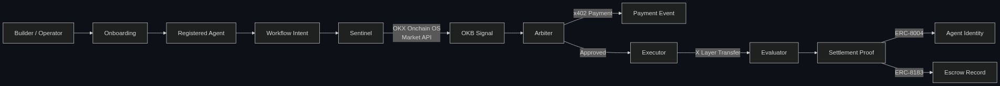

# NexusAgent


-blue)


[](https://web3.okx.com/zh-hans/onchainos)


NexusAgent is a multi-agent commerce and execution framework on X Layer.

It helps third-party AI agents:
- onboard through official-friendly integration paths
- participate in typed multi-agent workflows
- pay per call via x402 (OKX facilitator, on-chain USDT settlement)
- execute bounded actions on X Layer mainnet
- settle outcomes with explorer-verifiable proof

## What We Built

NexusAgent is intentionally split into two product surfaces:

### 1. Builder Surface
This is the real product wedge.

It shows how an external agent can enter the system through:
- `AI Skills + Agentic Wallet`
- `MCP + Agentic Wallet`
- `Open API + custom integration`

The onboarding surface defines:
- required registration fields
- capability declarations
- workflow role declarations
- wallet model expectations

### 2. Showcase Workflow Surface
This is the demo surface that proves the builder surface has value.

The current hero workflow is:

`Check the OKB market signal and, if the run is approved, execute a bounded stablecoin proof transfer on X Layer.`

The workflow runs through 9 explicit states:

`Onboarding -> Intent -> Signal -> Decision -> Preparation -> Payment -> Execution -> Evaluation -> Settlement`

## Why This Matters

NexusAgent demonstrates the infrastructure layer of the agentic economy:
- External agents can join through official onboarding paths
- Each agent has role-specific responsibilities and typed inputs/outputs
- Agents hand off work to each other through a deterministic state machine
- Payment and settlement are distinct, auditable steps
- Every outcome produces explorer-verifiable proof on X Layer

## Why The Four-Agent Split Exists

The agent roles are intentionally separated:
- `Sentinel` gathers external context
- `Arbiter` decides whether execution should proceed
- `Executor` prepares and performs the bounded action
- `Evaluator` checks whether the visible chain result matches the expected outcome

This keeps the system from collapsing into a single script that both acts and certifies itself.
In particular, the `Executor` and `Evaluator` split follows a simple evaluator-optimizer principle: action and verification should be distinct when correctness matters.

---

## ⚡ Stack

| Layer | Technology | Status |
|-------|-----------|--------|
| **Market Signal** | OKX Onchain OS Market API (authenticated) | Live |
| **DEX Routing** | OKX Onchain OS DEX Aggregator API | Live (quote-only) |
| **Payment** | x402 protocol via OKX Facilitator (EIP-3009 + on-chain settle) | Live |
| **Settlement** | X Layer ERC-20 transfers | Live (mainnet) |
| **Agent Identity** | ERC-8004 AgentRegistry on X Layer mainnet | Deployed + Integrated |
| **Agent Commerce** | ERC-8183 AgentEscrow on X Layer mainnet | Deployed + Integrated |
| **Agent Discovery** | A2A Agent Card (`/.well-known/agent.json`, 3 skills) | Live |
| **Connectivity** | MCP server (stdio, 5 tools) | Live |
| **Wallet Security** | OKX Agentic Wallet (sign-info API integrated; TEE via OKX) | Integrated |

## Agentic Wallet Integration

NexusAgent integrates with OKX Agentic Wallet at the API level:
- **Gas estimation** via Wallet `sign-info` API before chain operations (integrated in executor)
- **Wallet reachability check** during agent onboarding via Onchain OS API

OKX Agentic Wallet provides additional capabilities that agents can use directly:
- Email-based wallet creation via `npx skills add okx/onchainos-skills`
- TEE-protected key storage (OKX infrastructure, not managed by NexusAgent)
- Gas-optimized stablecoin operations on X Layer (OKX ecosystem)

## OKX Onchain OS Evidence

NexusAgent calls three Onchain OS APIs in production code paths:

| API | Code Path | Evidence |
|-----|-----------|---------|
| Market API | `integrations/okxMarket.ts` → Sentinel signal | OKB price in workflow output + `output/okx-proof/` |
| DEX API | `integrations/okxDex.ts` → DEX quote | Quote response (quote-only, no swap) |
| Wallet API | `integrations/okxWallet.ts` → gas estimation | Sign-info params in executor step output |

All authenticated with HMAC-SHA256 signed headers per OKX Onchain OS specification.
Evidence artifacts: `output/okx-proof/latest.json`

## Current Truthfulness Boundary

This repo is intentionally strict about protocol truthfulness.

### Live today
- OKB market signal via OKX Onchain OS Market API (authenticated, real-time price data)
- x402 payment endpoint: `GET /api/signals/premium-okb` returns HTTP 402 with PAYMENT-REQUIRED header, accepts X-PAYMENT for access
- DEX quote via Onchain OS aggregator (quote-only, no swap execution)
- A2A Agent Card at `/.well-known/agent.json` with 3 skills
- Full workspace-scoped alpha workflow with live OKB signal → conditional decision → bounded execution → RPC verification
- Mainnet settlement proofs with OKB Onchain OS signal (explorer-verifiable)
- ERC-8004 AgentRegistry + ERC-8183 AgentEscrow deployed on X Layer mainnet, called during workflow execution
- MCP server with 5 tools (get_okb_signal, get_dex_quote, check_settlement_proof, check_wallet_status, get_integration_status)
- OKX Agentic Wallet API: sign-info for gas estimation in executor, wallet reachability check in onboarding

### Integration Notes
- x402 payment: EIP-3009 → OKX facilitator verify → settle → on-chain USDT ([proof 1](https://www.oklink.com/xlayer/tx/0xd6d0fa98e9ad5e1be208f39371e81e1ee7d0275ff4b20ef6f38b9e4e82315edf), [proof 2](https://www.oklink.com/xlayer/tx/0x41fe452643fe099a0969e3de30a3f86765fcf611c1881dd73a81684f9bb7fb44))
- Workflow payment step records `transfer_event` when escrow is funded on-chain
- ERC-8183 escrow lifecycle runs best-effort (graceful degradation if token balance insufficient)
- DEX aggregator returns quote data; swap execution limited by on-chain pair liquidity

---

## 🔗 Settlement Proof

### Mainnet
- TX: `0x5c49ba298cccab1e6c05d1c27b4cc02816d21aa7f3c9de3c40c8d0eba905d37f`
- Explorer: [View on OKLink](https://www.oklink.com/xlayer/tx/0x5c49ba298cccab1e6c05d1c27b4cc02816d21aa7f3c9de3c40c8d0eba905d37f)
- 0.01 USDT bounded transfer on X Layer mainnet (chain 196)

## 📦 Deployed Smart Contracts (X Layer Mainnet)

| Contract | Address | Standard |
|----------|---------|----------|
| AgentRegistry | `0xB4dDf24c8a6cBDEB976d27C4A142f076272EfEC0` | ERC-8004 |
| AgentEscrow | `0xa5f560C60F5912bE1a44D24A78B6e82e7C50F455` | ERC-8183 |

4 agents registered on-chain. Escrow lifecycle (create → fund → submit → complete) runs during approved workflows. Current deployment uses single-signer demo ownership; multi-party signing is planned for a future release.

## 💰 x402 Payment Proof (X Layer Mainnet)

| TX | Explorer | Flow |
|----|----------|------|
| `0xd6d0fa98...` | [OKLink](https://www.oklink.com/xlayer/tx/0xd6d0fa98e9ad5e1be208f39371e81e1ee7d0275ff4b20ef6f38b9e4e82315edf) | EIP-3009 → OKX verify → settle |
| `0x41fe4526...` | [OKLink](https://www.oklink.com/xlayer/tx/0x41fe452643fe099a0969e3de30a3f86765fcf611c1881dd73a81684f9bb7fb44) | EIP-3009 → OKX verify → settle |

All proof artifacts: [shared/PROOF_ARTIFACT_REGISTER.md](./shared/PROOF_ARTIFACT_REGISTER.md)

## API Surface

The backend exposes the following endpoints:
- `POST /api/workspaces`
- `GET /api/workspaces/:workspaceId/context`
- `POST /api/workspaces/:workspaceId/agents`
- `GET /api/workspaces/:workspaceId/agents`
- `POST /api/workspaces/:workspaceId/agents/:agentId/verify-wallet`
- `POST /api/workspaces/:workspaceId/workflows`
- `GET /api/workspaces/:workspaceId/workflows`
- `GET /api/workspaces/:workspaceId/workflows/:workflowRunId`
- `GET /api/workspaces/:workspaceId/workflows/:workflowRunId/proof`
- `GET /api/workspaces/:workspaceId/usage`

### Onchain OS & x402 Endpoints
- `GET /api/signals/okb` — Live OKB market signal (Onchain OS Market API)
- `GET /api/signals/premium-okb` — x402-gated premium signal (returns 402 without payment)
- `GET /api/integrations/dex-quote` — DEX aggregator quote via Onchain OS
- `GET /api/integrations/status` — Integration status dashboard
- `GET /.well-known/agent.json` — A2A v0.3 Agent Card
- `GET /api/workspaces/:id/usage/summary` — Billing summary with per-run pricing

These endpoints establish:
- workspace ownership boundaries
- one workspace key per workspace
- persistent per-workspace agent registration
- wallet reference acceptance and activation gating (format validation + best-effort Onchain OS reachability check)
- one live-signal-backed workflow creation path
- persistent workflow and usage records
- server-side auto-selection of the canonical active agents when explicit agent ids are not provided
- bounded settlement for approved alpha runs (mainnet supported, testnet validated; configurable via execution env vars)

See the [Onboarding page](frontend/src/pages/Onboarding.tsx) for the full quickstart flow.

---

## 🛠 Run Locally

From the repo root:

```bash
./scripts/start_dev_stack.sh
```

Or run each surface explicitly:

```bash
cd ./backend
npm install
npm run dev
```

```bash
cd ./frontend
npm install
npm run dev -- --host 0.0.0.0
```

Or run the checks directly:

```bash
./scripts/validate_all.sh
./scripts/overnight_guard.sh
```

Check X Layer mainnet readiness:

```bash
./scripts/check_mainnet_readiness.sh
```

If you want to exercise the live X Layer testnet flow with a dedicated test key:

```bash
export NEXUSAGENT_XLAYER_TEST_PRIVATE_KEY=...
./scripts/validate_testnet_flow.sh
```

If you want to prove that the live builder layer can create a workspace-scoped workflow and produce a bounded live settlement artifact:

```bash
export NEXUSAGENT_XLAYER_TEST_PRIVATE_KEY=...
./scripts/validate_alpha_live_execution.sh
```

## Hosted Preview Preparation

The repository now includes a hosted preview blueprint:
- [render.yaml](./render.yaml)

Preview deployment assumptions:
- backend and frontend deploy as separate services
- frontend receives `VITE_API_BASE_URL`
- backend can restrict browser origins with `NEXUSAGENT_ALLOWED_ORIGINS`
- live execution remains disabled by default in preview

Frontend env example:
- [frontend/.env.example](./frontend/.env.example)

Hosted preview blueprint notes:
- [docs/31_HOSTED_PREVIEW_BLUEPRINT.md](./docs/31_HOSTED_PREVIEW_BLUEPRINT.md)

## 🏗 Architecture Snapshot



## ✅ Validation

Validation currently includes:
- backend typecheck / schema validation / build
- frontend lint / build
- frontend/backend contract sync
- API smoke test
- live settlement receipt verification through X Layer RPC
- optional bounded execution artifact generation when configured


## 📁 Repo Structure

- `docs/` — protocol truth table, environment contract, validation runbook
- `shared/` — agent specs, workflow state machine, proof register, API shapes
- `frontend/` — React/Vite frontend
- `backend/` — Express/TypeScript backend with OKX Onchain OS integration
- `contracts/` — Solidity smart contracts (ERC-8004 AgentRegistry, ERC-8183 AgentEscrow)
- `scripts/` — validation, dev stack, sync checks
- `examples/` — AI integration demos (REST client, MCP guide, x402 payment flow)

## 🤖 AI Integration Examples

```bash
# Demo 1: External AI agent calls NexusAgent REST API end-to-end
npx tsx examples/01_ai_agent_rest_client.ts

# Demo 2: x402 payment protocol flow (HTTP 402 → pay → 200)
bash examples/03_x402_payment_flow.sh

# Guide: MCP integration for Claude Desktop, GPT, LangChain, etc.
cat examples/02_mcp_integration.md
```

## Commercial Model

NexusAgent charges per workflow run:
- Signal check: 0.01 USDT
- Execution run: 0.10 USDT
- Escrow lifecycle: 0.05 USDT

All billing is usage-based, settled on X Layer via x402. No subscriptions, no credit cards, no KYC.
Workspace usage summaries available at `GET /api/workspaces/:id/usage/summary`.

## Roadmap

NexusAgent is designed to become a **builder-facing agent workflow operating layer**.

Core value chain: `Paid market signal → controlled execution → on-chain settlement and proof`

Target users: teams building agent-based trading strategies, research automation, or task settlement systems on X Layer.
