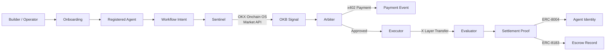

# NexusAgent

> [Demo Video](#) · [Submission Form](https://forms.gle/BgBD4SuvJ7936FU97) · [𝕏 @NexusAgentX](https://x.com/NexusAgentX)

NexusAgent is a multi-agent commerce and execution framework on X Layer.

It helps third-party AI agents:
- onboard through official-friendly integration paths
- participate in typed multi-agent workflows
- trigger pay-per-call compatible payment events
- execute bounded actions on X Layer
- settle outcomes with explorer-verifiable proof

## What We Built

NexusAgent is intentionally split into two product surfaces:

### 1. Builder Surface
This is the real product wedge.

It shows how an external agent can enter the system through:
- `AI Skills + Agentic Wallet`
- `MCP + Agentic Wallet`
- `Open API + custom integration`

The onboarding surface defines:
- required registration fields
- capability declarations
- workflow role declarations
- wallet model expectations

### 2. Showcase Workflow Surface
This is the demo surface that proves the builder surface has value.

The current hero workflow is:

`Check the OKB market signal and, if the run is approved, execute a bounded stablecoin proof transfer on X Layer.`

The workflow runs through 8 explicit states:

`Onboarding -> Intent -> Signal -> Decision -> Preparation -> Payment -> Execution -> Evaluation -> Settlement`

## Why This Matters

Most hackathon agent demos stop at one of these layers:
- a chatbot
- a single trading bot
- a UI wrapper around one tool call

NexusAgent tries to show the next layer of the agentic economy:
- agents can join a framework
- agents have role-specific responsibilities
- agents can hand off typed work to each other
- payment events and settlement are distinct
- proof is recorded on X Layer

## Why The Four-Agent Split Exists

The agent roles are intentionally separated:
- `Sentinel` gathers external context
- `Arbiter` decides whether execution should proceed
- `Executor` prepares and performs the bounded action
- `Evaluator` checks whether the visible chain result matches the expected outcome

This keeps the system from collapsing into a single script that both acts and certifies itself.
In particular, the `Executor` and `Evaluator` split follows a simple evaluator-optimizer principle: action and verification should be distinct when correctness matters.

## Stack

| Layer | Technology | Status |
|-------|-----------|--------|
| **Market Signal** | OKX Onchain OS Market API (authenticated) | Live |
| **DEX Routing** | OKX Onchain OS DEX Aggregator API | Live (quote-only) |
| **Payment** | x402 protocol (HTTP 402 flow, on-chain USDT settlement) | Live |
| **Settlement** | X Layer ERC-20 transfers (mainnet + testnet) | Live (mainnet) |
| **Agent Identity** | ERC-8004 AgentRegistry on X Layer mainnet | Deployed + Integrated |
| **Agent Commerce** | ERC-8183 AgentEscrow on X Layer mainnet | Deployed + Integrated |
| **Agent Discovery** | A2A v0.3 Agent Card (`/.well-known/agent.json`) | Live |
| **Coordination** | A2A v1.0 agent-to-agent protocol | Modeled |
| **Connectivity** | MCP server (stdio, 5 tools) | Live |
| **Wallet Security** | OKX Agentic Wallet API (TEE, sign-info) | Integrated |

## Agentic Wallet Integration

NexusAgent integrates OKX Agentic Wallet API for secure agent operations:
- **Gas estimation** via Wallet `sign-info` API before chain operations
- **Wallet verification** during agent onboarding via Onchain OS
- **TEE security** — private keys never leave the Trusted Execution Environment
- **Zero gas on X Layer** — OKX-sponsored gas for stablecoin operations

## OKX Onchain OS Evidence

NexusAgent calls three Onchain OS APIs in production code paths:

| API | Code Path | Evidence |
|-----|-----------|---------|
| Market API | `integrations/okxMarket.ts` → Sentinel signal | OKB price in workflow output + `output/okx-proof/` |
| DEX API | `integrations/okxDex.ts` → DEX quote | Quote response (quote-only, no swap) |
| Wallet API | `integrations/okxWallet.ts` → gas estimation | Sign-info params in executor step output |

All authenticated with HMAC-SHA256 signed headers per OKX Onchain OS specification.
Evidence artifacts: `output/okx-proof/latest.json`

## Current Truthfulness Boundary

This repo is intentionally strict about protocol truthfulness.

### Live today
- OKB market signal via OKX Onchain OS Market API (authenticated, real-time price data)
- x402 payment endpoint: `GET /api/signals/premium-okb` returns HTTP 402 with PAYMENT-REQUIRED header, accepts X-PAYMENT for access
- DEX quote via Onchain OS aggregator (quote-only, no swap execution)
- A2A Agent Card at `/.well-known/agent.json` with 3 skills
- Full workspace-scoped alpha workflow with live OKB signal → conditional decision → bounded execution → RPC verification
- Mainnet settlement proof + testnet settlement proofs with OKB Onchain OS signal
- ERC-8004 AgentRegistry + ERC-8183 AgentEscrow deployed on X Layer mainnet, called during workflow execution
- MCP server with 5 tools (get_okb_signal, get_dex_quote, check_settlement_proof, check_wallet_status, get_integration_status)
- OKX Agentic Wallet API: sign-info for gas estimation in executor, wallet reachability check in onboarding

### Simplified / Demo-compatible
- x402 payment verification uses txHash-based validation, not full EIP-3009 signature verification
- Workflow payment step records `transfer_event` when escrow is funded, `x402_compatible_demo` otherwise
- ERC-8183 escrow lifecycle runs best-effort (graceful degradation if token balance insufficient)
- DEX aggregator returns quote data but does not execute swaps

## Settlement Proof

### Mainnet
- TX: `0x5c49ba298cccab1e6c05d1c27b4cc02816d21aa7f3c9de3c40c8d0eba905d37f`
- Explorer: [View on OKLink](https://www.oklink.com/xlayer/tx/0x5c49ba298cccab1e6c05d1c27b4cc02816d21aa7f3c9de3c40c8d0eba905d37f)
- 0.01 USD₮0 bounded transfer on X Layer mainnet (chain 196)

### Testnet (Development)
- TX: `0x7d3fe82a1b8833ce1f7c0d063271a3678d1ffbb1c6e68fe8ee5c002fac5d224d`
- Explorer: [View on X Layer Testnet](https://web3.okx.com/zh-hans/explorer/x-layer-testnet/tx/0x7d3fe82a1b8833ce1f7c0d063271a3678d1ffbb1c6e68fe8ee5c002fac5d224d)
- 0.10 USD₮0 bounded transfer + 5 ERC-8183 escrow transactions

## Deployed Smart Contracts

### Mainnet (X Layer, chain 196)
| Contract | Address | Standard |
|----------|---------|----------|
| AgentRegistry | `0xB4dDf24c8a6cBDEB976d27C4A142f076272EfEC0` | ERC-8004 |
| AgentEscrow | `0xa5f560C60F5912bE1a44D24A78B6e82e7C50F455` | ERC-8183 |

4 agents registered on-chain (Sentinel, Arbiter, Executor, Evaluator).

### Testnet (X Layer, chain 1952)
| Contract | Address | Standard |
|----------|---------|----------|
| AgentRegistry | `0xc66DB3F3D07045686307674A261482d3e5EF9B79` | ERC-8004 | X Layer Testnet |
| AgentEscrow | `0xB4dDf24c8a6cBDEB976d27C4A142f076272EfEC0` | ERC-8183 | X Layer Testnet |

Deployer: `0x031189016E014447C467163D4A818D847359f980`

The workflow engine calls ERC-8183 escrow lifecycle (create → fund → submit → complete) during approved execution runs. Agent registration writes ERC-8004 on-chain identity.

## Full-Stack Proof (5 On-Chain Transactions)

The latest alpha workflow produced a full-stack artifact with 5 verifiable on-chain transactions:

| Step | TX Hash | Purpose |
|------|---------|---------|
| Settlement | `0x699d823f40a6...` | Bounded 0.10 USD₮0 transfer |
| Escrow Create | `0x488e04d94070...` | ERC-8183 job creation |
| Escrow Fund | `0xc4093c47dc20...` | Escrow funding |
| Escrow Submit | `0x75f16274c29e...` | Deliverable submission |
| Escrow Complete | `0x9ec6364367f7...` | Fund release to agent |

All transactions are verifiable on the [X Layer Explorer](https://www.oklink.com/xlayer).

The single source of truth for proof artifacts is:
- [shared/PROOF_ARTIFACT_REGISTER.md](./shared/PROOF_ARTIFACT_REGISTER.md)

The private builder alpha now also has a repeatable live testnet execution validation path:
- latest alpha live artifact:
  - [output/alpha-live/latest.md](./output/alpha-live/latest.md)

## Local Surfaces

- landing: `http://localhost:5173/`
- onboarding: `http://localhost:5173/onboarding`
- dashboard: `http://localhost:5173/dashboard`
- backend health: `http://localhost:8787/api/health`

## Alpha Foundations Now Live

The backend now includes the first external-usable alpha foundations:
- `POST /api/workspaces`
- `GET /api/workspaces/:workspaceId/context`
- `POST /api/workspaces/:workspaceId/agents`
- `GET /api/workspaces/:workspaceId/agents`
- `POST /api/workspaces/:workspaceId/agents/:agentId/verify-wallet`
- `POST /api/workspaces/:workspaceId/workflows`
- `GET /api/workspaces/:workspaceId/workflows`
- `GET /api/workspaces/:workspaceId/workflows/:workflowRunId`
- `GET /api/workspaces/:workspaceId/workflows/:workflowRunId/proof`
- `GET /api/workspaces/:workspaceId/usage`

### Onchain OS & x402 Endpoints
- `GET /api/signals/okb` — Live OKB market signal (Onchain OS Market API)
- `GET /api/signals/premium-okb` — x402-gated premium signal (returns 402 without payment)
- `GET /api/integrations/dex-quote` — DEX aggregator quote via Onchain OS
- `GET /api/integrations/status` — Integration status dashboard
- `GET /.well-known/agent.json` — A2A v0.3 Agent Card
- `GET /api/workspaces/:id/usage/summary` — Billing summary with per-run pricing

These endpoints establish:
- workspace ownership boundaries
- one workspace key per private alpha workspace
- persistent per-workspace agent registration
- wallet verification and activation gating
- one live-signal-backed workflow creation path
- persistent workflow and usage records
- server-side auto-selection of the canonical active agents when explicit agent ids are not provided
- an optional bounded live testnet settlement path for approved alpha runs when explicit execution env vars are enabled

They are the first step from hackathon demo toward private builder alpha.

## Alpha API Quickstart

1. Create a workspace
2. Save the returned `workspace_key`
3. Register one Sentinel, Arbiter, Executor, and Evaluator with that workspace key
4. Verify each wallet reference
5. Create a workspace-scoped workflow run
6. Inspect history, proof, and usage

`requestedAgentIds` can now be omitted for the alpha workflow API when the workspace already has one active verified Sentinel, Arbiter, Executor, and Evaluator. In that case the server auto-selects the canonical agent set.

Workspace-scoped alpha endpoints now require either:
- `Authorization: Bearer <workspace_key>`
- `X-NexusAgent-Workspace-Key: <workspace_key>`

The automated smoke test exercises this path end-to-end:

```bash
./scripts/smoke_api.sh
```

## Run Locally

From the repo root:

```bash
./scripts/start_dev_stack.sh
```

Or run each surface explicitly:

```bash
cd ./backend
npm install
npm run dev
```

```bash
cd ./frontend
npm install
npm run dev -- --host 0.0.0.0
```

Or run the checks directly:

```bash
./scripts/validate_all.sh
./scripts/overnight_guard.sh
```

Check X Layer mainnet submission readiness:

```bash
./scripts/check_mainnet_readiness.sh
```

If you want to exercise the live X Layer testnet flow with a dedicated test key:

```bash
export NEXUSAGENT_XLAYER_TEST_PRIVATE_KEY=...
./scripts/validate_testnet_flow.sh
```

If you want to prove that the private builder alpha can create a workspace-scoped workflow and produce a bounded live settlement artifact:

```bash
export NEXUSAGENT_XLAYER_TEST_PRIVATE_KEY=...
./scripts/validate_alpha_live_execution.sh
```

## Hosted Preview Preparation

The repository now includes a hosted preview blueprint:
- [render.yaml](./render.yaml)

Preview deployment assumptions:
- backend and frontend deploy as separate services
- frontend receives `VITE_API_BASE_URL`
- backend can restrict browser origins with `NEXUSAGENT_ALLOWED_ORIGINS`
- live execution remains disabled by default in preview

Frontend env example:
- [frontend/.env.example](./frontend/.env.example)

Hosted preview blueprint notes:
- [docs/31_HOSTED_PREVIEW_BLUEPRINT.md](./docs/31_HOSTED_PREVIEW_BLUEPRINT.md)

## Architecture Snapshot



## Validation

Validation currently includes:
- backend typecheck / schema validation / build
- frontend lint / build
- frontend/backend contract sync
- API smoke test
- overnight snapshot artifacts
- live settlement receipt verification through X Layer RPC on the proof path
- optional live alpha execution artifact generation when a dedicated testnet key is present

Validation runbook:
- [docs/16_VALIDATION_RUNBOOK.md](./docs/16_VALIDATION_RUNBOOK.md)

Latest overnight summary:
- [docs/19_MORNING_HANDOFF.md](./docs/19_MORNING_HANDOFF.md)

## Repo Structure

- `docs/` — strategy, narrative, truth table, validation, handoff
- `shared/` — contracts, workflow state machine, demo specs, proof register
- `frontend/` — React/Vite frontend
- `backend/` — Express/TypeScript backend with OKX Onchain OS integration
- `contracts/` — Solidity smart contracts (ERC-8004 AgentRegistry, ERC-8183 AgentEscrow)
- `scripts/` — validation, dev stack, overnight guard, sync checks
- `examples/` — AI integration demos (REST client, MCP guide, x402 payment flow)

## AI Integration Examples

```bash
# Demo 1: External AI agent calls NexusAgent REST API end-to-end
npx tsx examples/01_ai_agent_rest_client.ts

# Demo 2: x402 payment protocol flow (HTTP 402 → pay → 200)
bash examples/03_x402_payment_flow.sh

# Guide: MCP integration for Claude Desktop, GPT, LangChain, etc.
cat examples/02_mcp_integration.md
```

## Hackathon Framing

NexusAgent is not presented as a single bot.

It is presented as a framework where:
- agents can be onboarded simply
- roles are explicit
- workflow steps are typed
- payment and settlement are modeled separately
- settlement proof is recorded on X Layer

That is the core claim of the project.

## Commercial Model

NexusAgent charges per workflow run:
- Signal check: 0.01 USDT
- Execution run: 0.10 USDT
- Escrow lifecycle: 0.05 USDT

All billing is usage-based, settled on X Layer via x402. No subscriptions, no credit cards, no KYC.
Workspace usage summaries available at `GET /api/workspaces/:id/usage/summary`.

## Post-Hackathon Direction

NexusAgent is designed to become a **builder-facing agent workflow operating layer**, not a consumer product.

The highest-value commercial path is:
`Paid market signal → controlled execution → on-chain settlement and proof`

First customers: teams building agent-based trading strategies, research automation, or task settlement systems that need a unified integration layer on X Layer.
